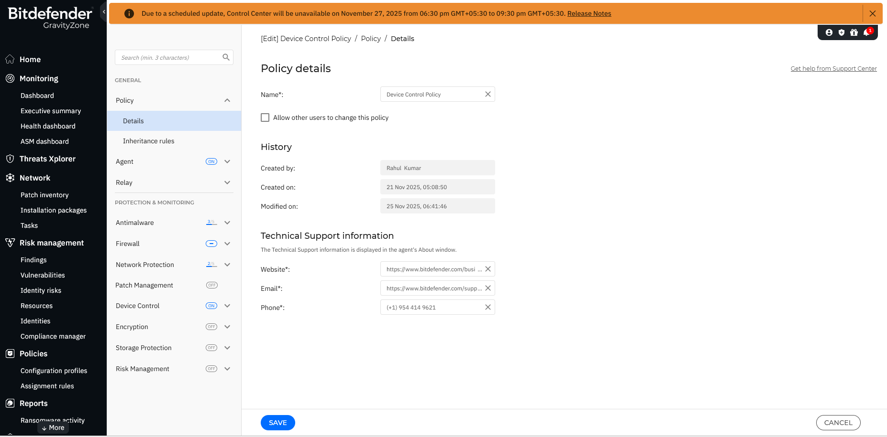
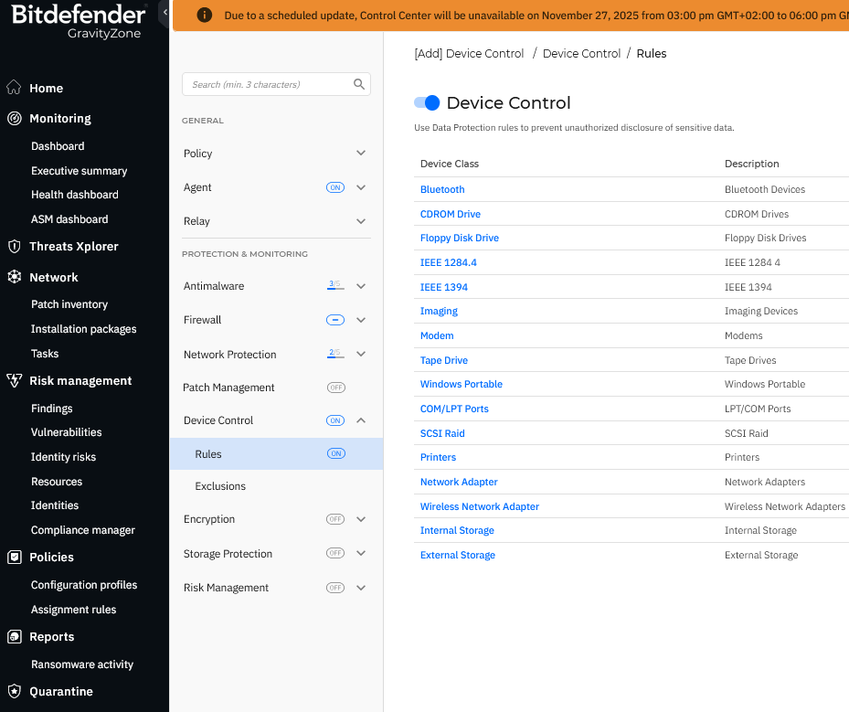

# Bitdefender GravityZone – Device Control Policy Project

This project shows how I configured and tested a **Bitdefender GravityZone policy** with:

- **Device Control** (USB / external storage / Bluetooth / CDROM)
- **Whitelisting** using Device ID
- **Evidence from logs & endpoint notifications**

It simulates how a real company protects endpoints against **data leakage via USB**.

---

## 🎯 Objectives

- Block all unauthorized USB and removable storage devices.
- Block Bluetooth, imaging and CDROM usage.
- Allow only **IT-approved USB** based on Device ID.
- Monitor Device Control events in **Threats Xplorer** and on the endpoint.
- Show full end-to-end evidence in screenshots and test cases.

---

## 🛠 Environment & Tools

- **Bitdefender GravityZone** cloud console  
- **Bitdefender Endpoint Security Tools** on Windows 10 VM  
- Policies: `Device Control Policy`  
- Logs: Threats Xplorer → Device Control activity

---


# 🔐 Bitdefender GravityZone – Device Control Policy Project  
A complete demonstration of **USB, Bluetooth, CD-ROM blocking**, along with **Authorized USB exception handling**, implemented and tested in **Bitdefender GravityZone**.

---

## 📁 **Project Overview**
This project showcases:
- Full Device Control Policy creation  
- Blocking unauthorized USB & external storage  
- Blocking Bluetooth, CD-ROM  
- Adding exceptions for Authorized USB devices  
- Log verification (Allowed / Blocked events)  
- Applying policy to endpoints  

---

# 📸 **Screenshots (Step-by-Step)**  
> *All screenshots are arranged in sequence so recruiters can easily understand the project workflow.*

---

## **1️⃣ Policy Creation**


---

## **2️⃣ Device Control Module ON**


---

## **3️⃣ External Storage Rule – Block All**
.png)

---

## **4️⃣ Bluetooth Blocking Rule**
.png)

---

## **5️⃣ CD-ROM Drive Blocking Rule**


---

## **6️⃣ Exclusion Menu (Before Adding)**
.png)

---

## **7️⃣ Add Exclusion – Select USB Device ID**
.png)

---

## **8️⃣ Mark Authorized USB**


---

## **9️⃣ Exclusion Added Successfully**
.png)

---

## **🔟 Allowed USB Pop-up on Endpoint**


---

---

# **📊 Logging & Verification**

## **1️⃣ Allowed & Blocked Events in Threats Xplorer**
.png)

---

## **2️⃣ Unauthorized USB Block Warning**


---

## **3️⃣ Blocked Event in Logs (Unauthorized USB)**
.png)

---

## **4️⃣ Policy Applied to Endpoints**


---

# 🚀 **Conclusion**
This project demonstrates:
- Real-world Enterprise Endpoint Security  
- Fine-grained Device Control  
- Policy enforcement  
- Logging & Threat visibility  
- Exception handling for business-approved devices  

This is a **complete hands-on EDR/Device Control project** suitable for SOC, MDR, Security Engineering & IT Security roles.

---

# ⭐ **Author**
**Rahul Kumar**  
Security Analyst (Aspiring)  


## 📂 Project Structure

```text
Bitdefender-Device-Control-Project/
├── Screenshots/
├── Test-Cases/
└── README.md


