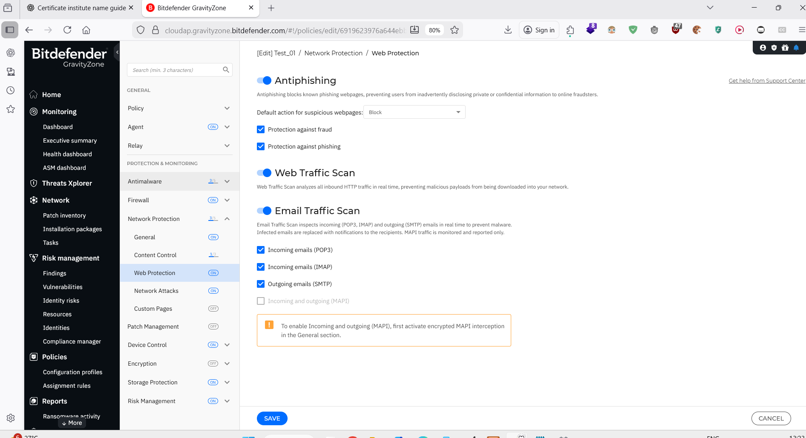
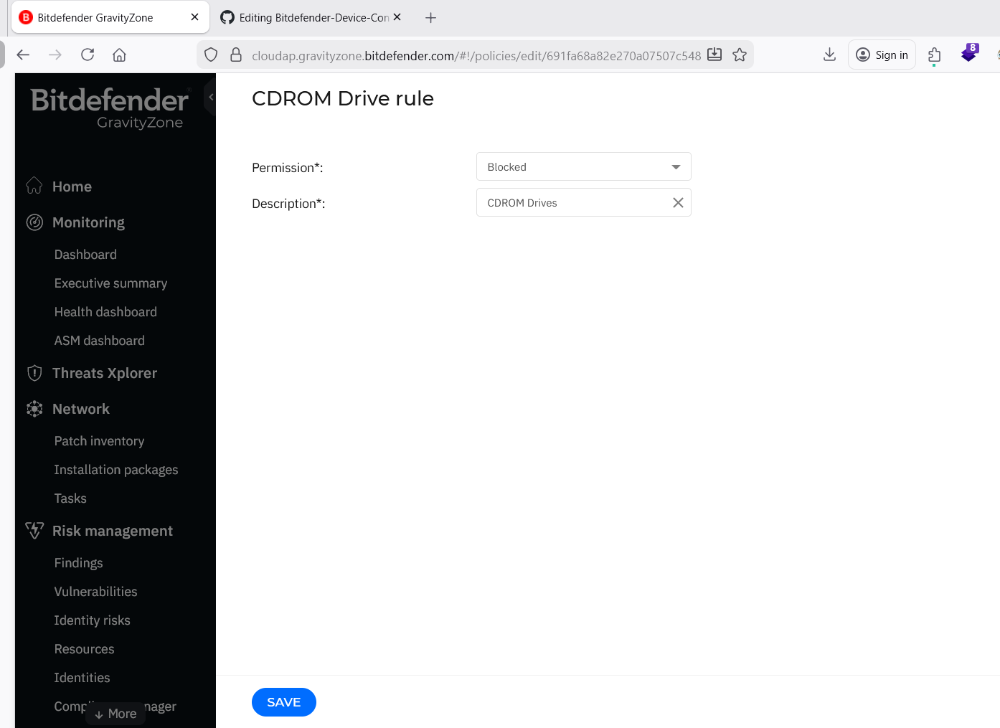
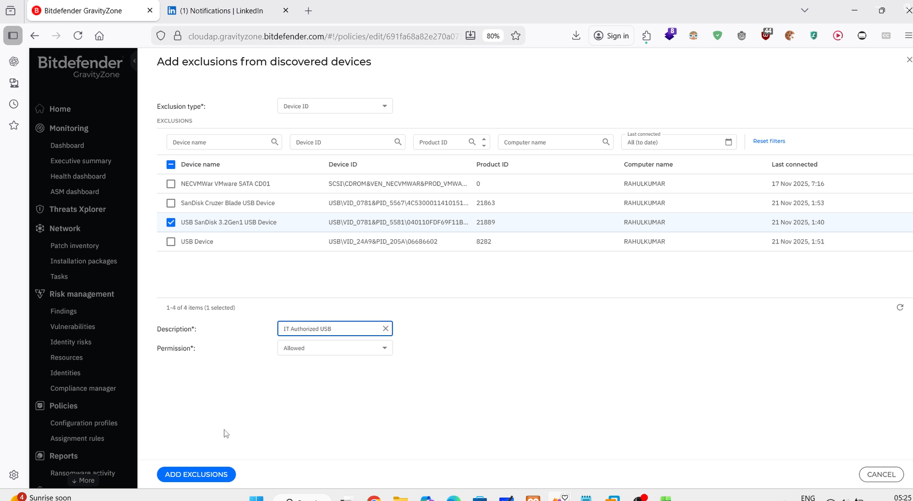
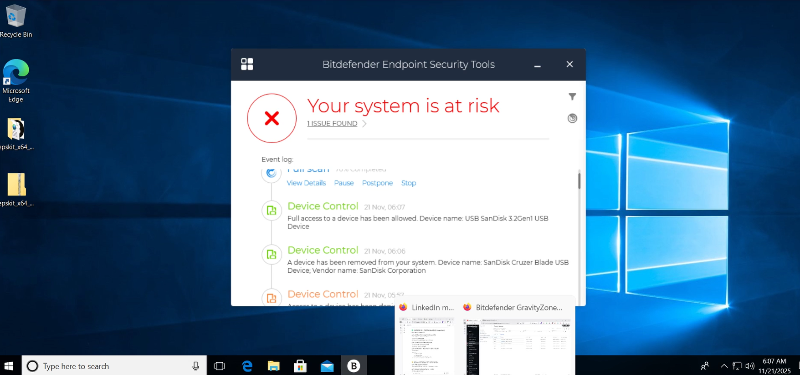
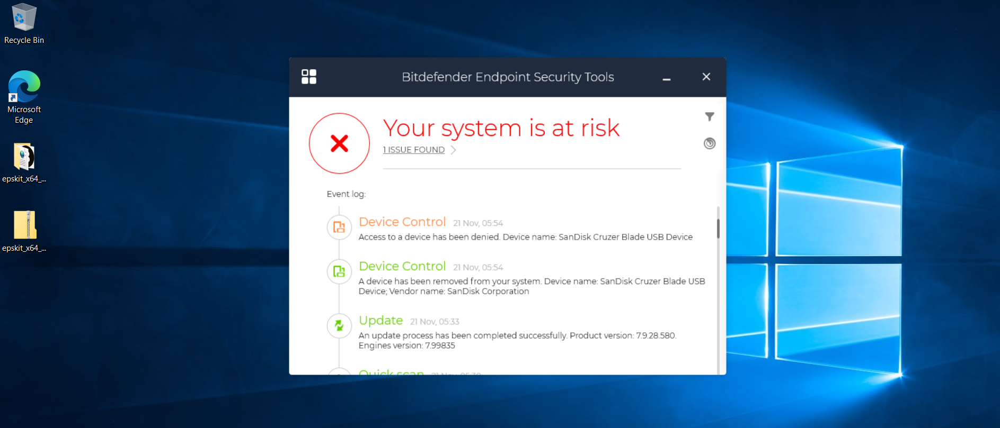
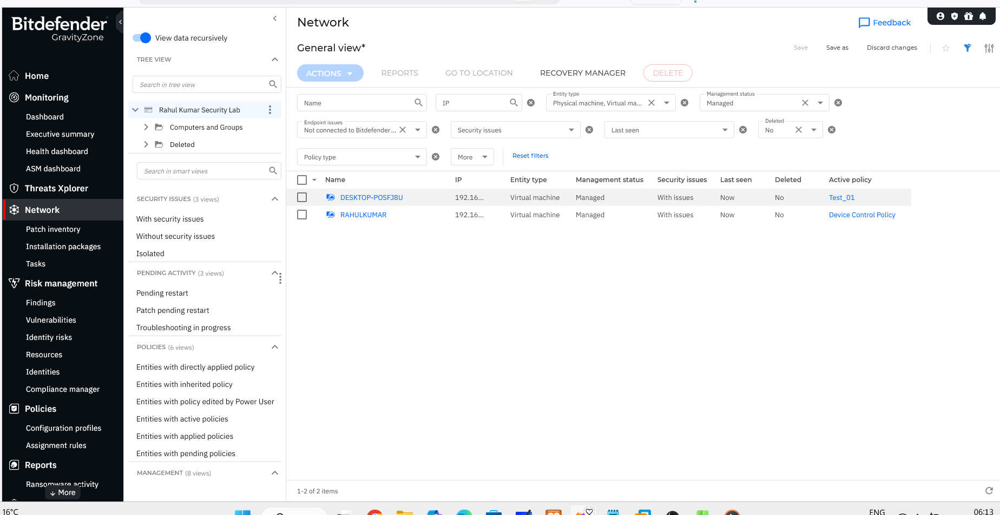

# Bitdefender GravityZone – Device Control Policy Project

This project shows how I configured and tested a **Bitdefender GravityZone policy** with:

- **Device Control** (USB / external storage / Bluetooth / CDROM)
- **Whitelisting** using Device ID
- **Evidence from logs & endpoint notifications**

It simulates how a real company protects endpoints against **data leakage via USB**.

---

## 🎯 Objectives

- Block all unauthorized USB and removable storage devices.
- Block Bluetooth, imaging and CDROM usage.
- Allow only **IT-approved USB** based on Device ID.
- Monitor Device Control events in **Threats Xplorer** and on the endpoint.
- Show full end-to-end evidence in screenshots and test cases.

---

## 🛠 Environment & Tools

- **Bitdefender GravityZone** cloud console  
- **Bitdefender Endpoint Security Tools** on Windows 10 VM  
- Policies: `Device Control Policy`  
- Logs: Threats Xplorer → Device Control activity

---

## 📂 Project Structure

```text
Bitdefender-Device-Control-Project/
├── Screenshots/
├── Test-Cases/
└── README.md


Screenshots are in the **Screenshots/** folder.  
Test cases are in **Test-Cases/device_control_test_cases.md**.

---

# 🔵 Step-by-Step (With Screenshots)

### **STEP 1 – Device Control Module Enabled**


### **STEP 2 – Device Classes Overview**


---

## 🔒 Device Blocking Rules

### **STEP 3 – USB / External Storage Blocked**
.png)

### **STEP 4 – Bluetooth Blocked**
.png)

### **STEP 5 – CDROM Blocked**


---

## 🟩 Whitelisting (Exclusions)

### **STEP 6 – Exclusion List (Empty)**
.png)

### **STEP 7 – Add Exclusion (Device ID)**
.png)

### **STEP 8 – Mark Authorized USB as Allowed**


### **STEP 9 – Whitelist Saved**
.png)

---

## 🧪 Testing & Results

### **STEP 10 – Allowed USB (Pop-Up)**


### **STEP 11 – Allowed USB (Threats Xplorer Log)**
.png)

### **STEP 12 – Blocked USB (Pop-Up)**


### **STEP 13 – Blocked USB (Threats Xplorer Log)**
.png)

---

## 🔧 STEP 14 – Policy Applied to Endpoint


---

# 📊 Test Cases
Full test cases available here:


